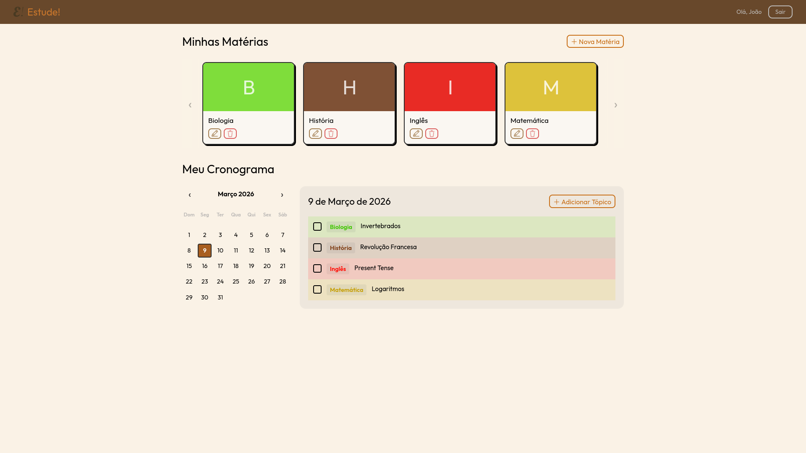
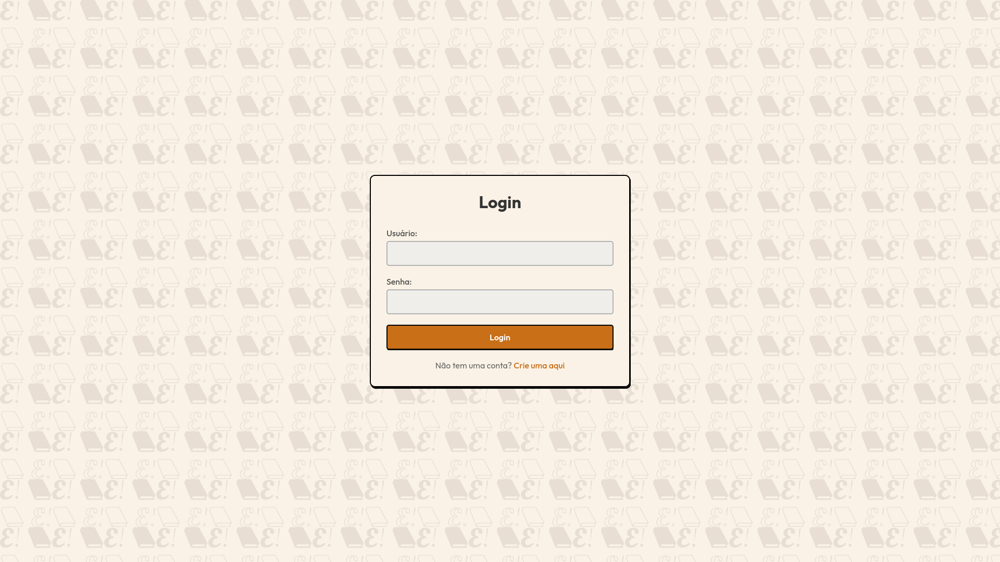
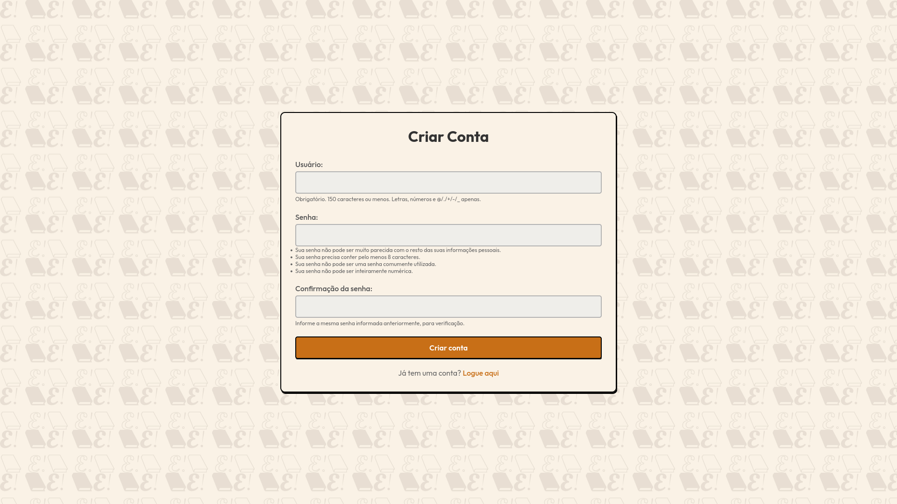
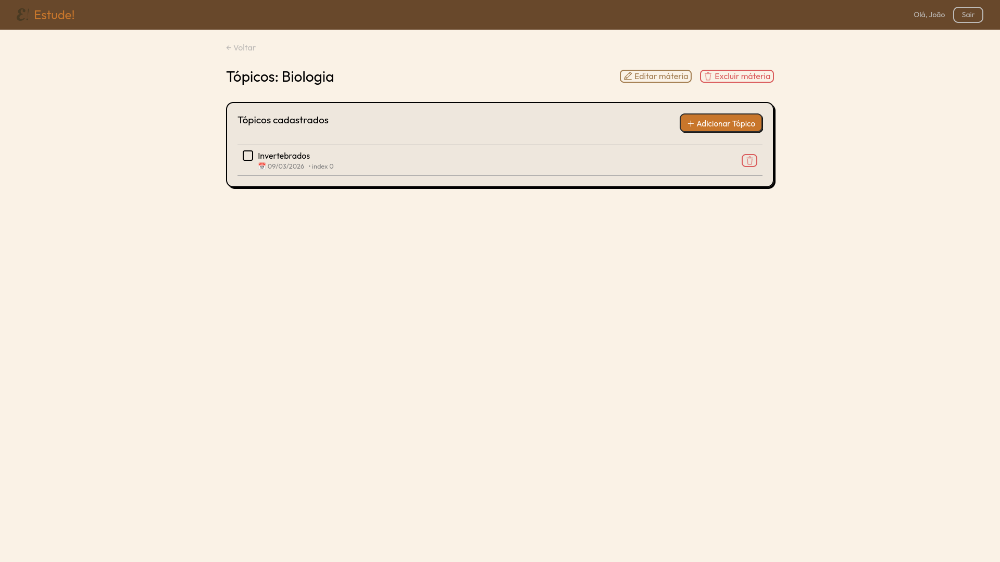
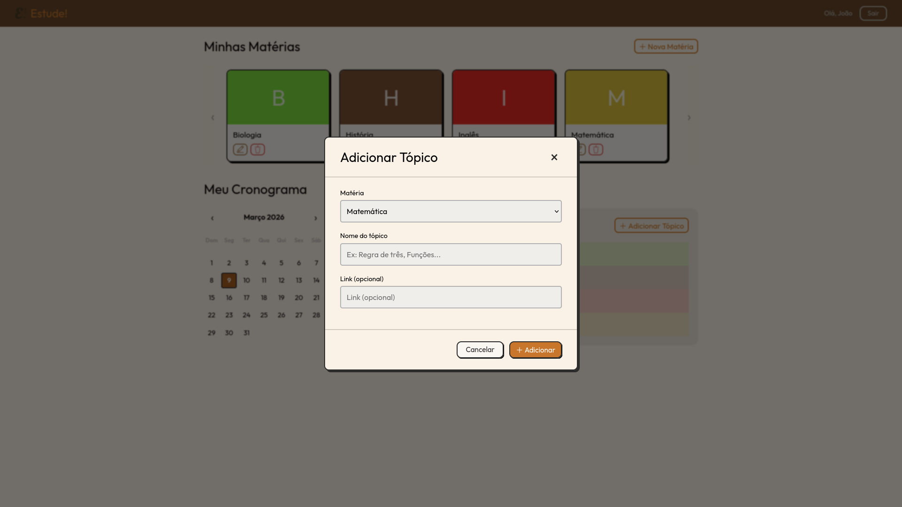

## Sobre o projeto
Estude! é um website feito para facilitar a gerência de cronogramas de estudos.

> Nota: O Vídeo de Apresentação do Projeto se encontra na pasta principal do repositório.

### Integrantes:
- Fernando Augusto De Araujo
- Flávia Maria Dos Santos Castro
- Gabriel Fonseca Sales
- Henrique Jorge Oliveira Almeida
- João Gabriel Rodrigues De Jesus

## Sobre a aplicação

O website permite usuários criar matérias e adicionar tópicos para estudar, os quais podem ser associados com um link e agendados para uma data de escolha. A página inicial da aplicação lista as matérias e dispõe o cronograma de estudos para a data selecionada.

## Rodando o Projeto
### Subindo Servidor de Produção com o Docker Compose
O [Docker](https://www.docker.com/resources/what-container/) dispensa a instalação das dependências do projeto e, portanto, recomendamos esse método para testar o programa:

1. Instale o [Docker](https://www.docker.com/products/docker-desktop/).
2. Depois de navegar para a raiz do projeto, suba o container:
```bash
docker compose -f docker/docker-compose.yml up
```
3. Abra o site em: [http://localhost:8000/login](http://localhost:8000/login)

> **Nota**: Caso seja necessário subir o container com o estado inicial novamente, por favor pare o mesmo e limpe os volumes com o seguinte comando:
```bash
docker compose -f ./docker/docker-compose.yml down && docker volume rm -f estude-db estude-staticfiles && docker compose -f ./docker/docker-compose.yml up --build
```

### Subindo o Servidor de Desenvolvimento
1. Instale o [Python](https://www.python.org/downloads/windows/), no instalador marque a opção 'Add python to path'. Após a instalação, reinicie seu computador.
2. Instale o [uv](https://docs.astral.sh/uv/getting-started/installation/), esse programa substitui o pip e venv, facilitando o desenvolvimento:
```bash
pip install uv
```
3. Navegue para a pasta do projeto e, em seguida, instale as dependências do projeto:
```bash
uv sync
```
4. Atualize as tabelas do banco de dados:
```bash
uv run src/manage.py migrate
```
5. Suba o servidor de desenvolvimento:
```bash
uv run src/manage.py runserver
```
6. Abra o site em: [http://localhost:8000/login](http://localhost:8000/login)

## Proposta
Na entrega anterior do Projeto Integrador, descrevemos a ideia de uma plataforma direcionada a estudantes que facilitasse a gerência de cronogramas de estudo através de uma interface interativa. Decidimos implementar uma prova de conceito que abordasse o conceito geral dessa plataforma, dando ênfase sobretudo no CRUD da aplicação. Dessa forma, colocamos como objetivo desenvolver a maneira de representar os cronogramas e as matérias, bem como, deixar a plataforma visualmente engajante, porém profissional dado o público-alvo.
Foi-se decidido que a plataforma teria suporte para múltiplos usuários, oferecendo o recurso de gerenciar matérias, cada uma podendo agrupar vários tópicos, e cada tópico, por sua vez, tendo um título, uma data de agenda e um link (URL) opcional. Esse estrutura permite que os estudantes criem um cronograma de tópicos e artigos para estudarem.

Abaixo exploramos nossas decisões de design quanto à arquitetura.

## Arquitetura do Projeto
### Tech-Stack e decisões de design
Escolhemos o Django visto a maior familiaridade do grupo com o python e tecnologias web vanilla (HTML, CSS) e sua maior relevância para o curso.
Esse framework separa as configurações da codebase em um 'projeto' (no nosso caso src/estude) e um ou mais 'aplicativos', que contém o código e a lógica da aplicação em si (no nosso caso usamos só um, que está na pasta src/website).

#### Estrutura do projeto
O Django separa a aplicação usando o modelo MVT (Model-View-Template)[1](https://www.geeksforgeeks.org/python/django-project-mvt-structure/), no qual a View (declarada em src/website/views.py) manipula e interaje com os dados do Model e os passa para os Templates correspondentes em src/website/templates.
Cada tela pode ser acessada em uma URL diferente, e as diferentes rotas do projeto estão declaradas no arquivo src/website/urls.py.

#### Sobre o Docker
Decidimos também colocar um Docker para facilitar a inspeção do projeto, e portanto o gunicorn foi adicionado como dependência extra, segundo sugestão da [documentação](https://docs.djangoproject.com/en/6.0/howto/deployment/). O Docker contém duas instâncias: uma é responsável pelo Django, enquanto a outra serve os arquivos estáticos da aplicação (favicon, CSS etc.) usando o Nginx.

#### Endpoints disponíveis

| Página                       | URL                       |
|------------------------------|---------------------------|
| Cadastro                     | `/register/`              |
| Login                        | `/login/`                 |
| Logout                       | `/logout/`                |
| Lista de matérias            | `/materia/`               |
| Nova matéria                 | `/materias/nova/`         |
| Detalhes da matéria          | `materias/<pk>/`          |
| Editar matéria               | `/materias/<pk>/editar/`  |
| Excluir matéria              | `/materias/<pk>/deletar/` |
| Listar tópicos               | `/agenda/`                |
| Completar um tópico (evento) | `topics/<pk>/toggle/`     |
| Deletar um tópico (evento)   | `topics/<pk>/deletar/`    |

## Galeria de imagens




